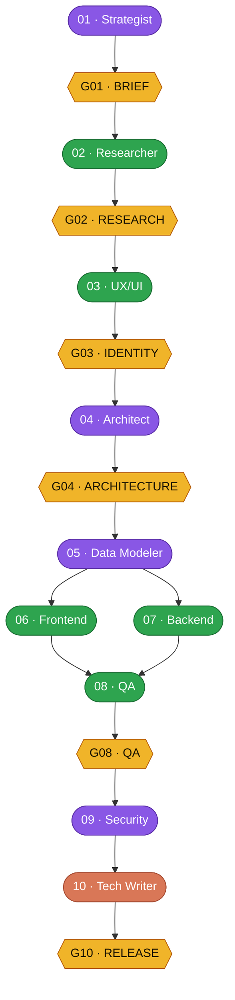
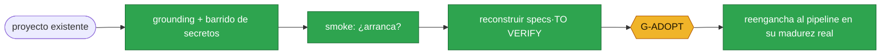

# 6SNT-Studio

**Un estudio de software de 10 agentes con gates, para [Claude Code](https://docs.claude.com/en/docs/claude-code) (agent-teams).**

[English](README.md) · `Español`

[](LICENSE)


Diez agentes de IA especializados construyen software en un pipeline disciplinado. Cada agente posee **un** entregable, y **nada avanza sin aprobación humana explícita** en su gate. El resultado es software hecho por IA con la previsibilidad de un proceso de ingeniería real — no un prompt de una sola pasada.

> **De un vistazo:** 10 agentes · 6 gates humanas · 11 principios · 8 reglas de ejecución · modelos en 3 tiers (opus/sonnet/haiku) · **2 caminos de entrada (greenfield + brownfield)** · local-first.

> El estudio **no es un proyecto** — es la infraestructura que sirve a todos los proyectos.
> Los proyectos pasan; el estudio permanece.

— Construido y operado por **CA6SNT** (Valdivia, Chile). Primero el método, poca burocracia: *el procedimiento es el producto.*

---

## 🚀 Instalación (Claude Code)

En una sesión de Claude Code:

```
/plugin marketplace add 6SNT-RADIO/6SNT-Studio
/plugin install studio@6SNT-Studio
```

Eso instala los 10 agentes, las skills, los hooks, los comandos `/startsnt` y `/adopt`, y el scaffolder de proyectos. ¿Repo privado? corre `gh auth login` una vez primero.

**Prerrequisito — activar agent-teams.** El estudio corre sobre el *agent-teams* experimental de Claude Code. Un plugin no puede activarlo por ti, así que agrega el flag a tu `~/.claude/settings.json` y reinicia Claude Code:

```json
{ "env": { "CLAUDE_CODE_EXPERIMENTAL_AGENT_TEAMS": "1" } }
```

*(Opcional: variables OpenTelemetry para observabilidad local — ver [docs/PIPELINE.md](docs/PIPELINE.md).)*

Luego, en una sesión rooteada en la carpeta de tu proyecto: **¿idea nueva?** corre `/startsnt` (greenfield, intake guiado). **¿proyecto existente?** corre `/adopt` (rampa brownfield).

---

## 🧭 La idea en una imagen



*Las cajas tienen color por tier de modelo (opus / sonnet / haiku); los hexágonos ámbar son las **gates humanas** (aprobación del PO). 06 ∥ 07 corren en paralelo.*

Un **Product Owner (PO)** humano aprueba cada gate. Un **Lead** orquesta (crea tareas, asigna dueños, cierra gates) pero **nunca escribe código ni entregables**. Los diez agentes hacen el trabajo — un artefacto cada uno.

### Dos caminos de entrada

**Greenfield** — una idea → `/startsnt` → el pipeline de arriba. **Brownfield** — un proyecto existente (hecho en otra parte / a mano) → `/adopt`: una rampa que ancla el código real, reconstruye sus specs (marcando inferencias `[TO VERIFY]`), pasa **una** gate humana y reengancha al pipeline en la madurez real del proyecto. No es un segundo pipeline — es una rampa.



---

## 🧩 Tres piezas

| Pieza | Rol |
|---|---|
| **Lead / Orquestador** | Coordina: clasifica el tamaño, arma el grafo de tareas, enruta escalados, cierra gates. **No** produce entregables. |
| **Agentes 01–10** | Cada uno ejecuta su etapa al activarse y entrega **un** artefacto (ver [AGENTS](docs/AGENTS.md)). |
| **Product Owner (humano)** | Aprueba entregables en cada gate y toma las decisiones que los agentes no pueden. Ningún agente reemplaza al PO. |

---

## ✅ Por qué funciona

- **Un agente, un entregable.** Un mapa de propiedad duro (ver [AGENTS](docs/AGENTS.md)) — un agente puede *leer* lo que sea pero solo *escribe* su zona. Los choques de frontera se escalan, no se resuelven entre agentes.
- **Gating proporcional.** El trabajo se clasifica **TRIVIAL / ESTÁNDAR / COMPLEJO**; solo corren las gates que importan. Agregar gates a un pipeline gated *aumenta* el fracaso — el estudio usa por defecto el tamaño más pequeño que encaje.
- **El "terminado" es mecánico.** "Terminado" incluye un artefacto que **arranca**, probado por un smoke automático. El release se bloquea hasta que existan artefacto + smoke-pass + assets.
- **Revisión adversarial y cost-aware.** Un `critic` externo ataca cada entregable antes de su gate (la revisión externa supera a la auto-revisión); los gates subjetivos (marca) usan un jurado keyless de varios tiers, no un solo juez.
- **Enforcement donde es determinista, normas donde no se puede.** Los guards de sesión son candados reales; la propiedad por-agente es una *norma* auditada post-hoc por trazas OpenTelemetry. Ver [PIPELINE](docs/PIPELINE.md).

---

## 📚 Documentación

| Doc | Qué contiene |
|---|---|
| [docs/AGENTS.md](docs/AGENTS.md) | Los 10 agentes: rol, tier, entregable único, propiedad, topología de escalado. |
| [docs/SKILLS.md](docs/SKILLS.md) | Skills y mecanismos: critic, smoke, rúbrica de marca + jurado, intake gating, grounding brownfield, scaffolding, evals, observabilidad. |
| [docs/PIPELINE.md](docs/PIPELINE.md) | Los dos caminos de entrada, las 6 gates humanas + G-ADOPT, el grafo de tareas, la clasificación de tamaño, y qué es mecánico vs norma. |
| [docs/PRINCIPLES.md](docs/PRINCIPLES.md) | Principios **P-01…P-11** y reglas de ejecución **RC-01…RC-08** (la constitución del estudio). |

Las piezas ejecutables viven en la raíz: `agents/` (los 10 agentes), `skills/` (las skills del estudio, incl. `critic` y `adopt-ground`), `hooks/`, `commands/` (`/startsnt`, `/adopt`), `scripts/` (el scaffolder) y `templates/`. Las copias de referencia en español de los agentes están en [`i18n/es/`](i18n/es/).

---

## 🎚️ Tiers de modelo (coste-consciente)

| Tier | Agentes |
|---|---|
| **opus** | 01 Strategist · 04 Architect · 05 Data Modeler · 09 Security |
| **sonnet** | 02 Researcher · 03 UX/UI · 06 Frontend · 07 Backend · 08 QA |
| **haiku** | 10 Technical Writer |

El lead puede subir un tier para una tarea dura puntual.

---

## 📦 Estado

- ✅ Método validado construyendo **apps de escritorio reales** de punta a punta por el pipeline gated (QA cazó bugs de dominio reales; Security remedió hallazgos; marca y arquitectura pasaron rúbricas máquina).
- ✅ Corre sobre **agent-teams** de Claude Code con observabilidad OpenTelemetry nativa y evals `promptfoo` como pre-gate.
- 🌐 Los agentes/skills/comandos activos están en **inglés**; las copias de referencia en español viven en `i18n/es/`.

---

## 🔧 Adaptarlo a tu trabajo

El estudio es **project-agnostic por diseño** (principio P-10): ningún agente hardcodea un proyecto específico. Para adoptarlo, conservas la constitución ([PRINCIPLES](docs/PRINCIPLES.md)) y el mapa de propiedad ([AGENTS](docs/AGENTS.md)), y apuntas los agentes a tu stack. El stack de referencia aquí es apps de escritorio Electron + TypeScript, pero el método es neutral al stack.

---

## ⚖️ Licencia

[MIT](LICENSE) © 2026 CA6SNT (Luis Soto). Úsalo, adáptalo, construíe con él.
