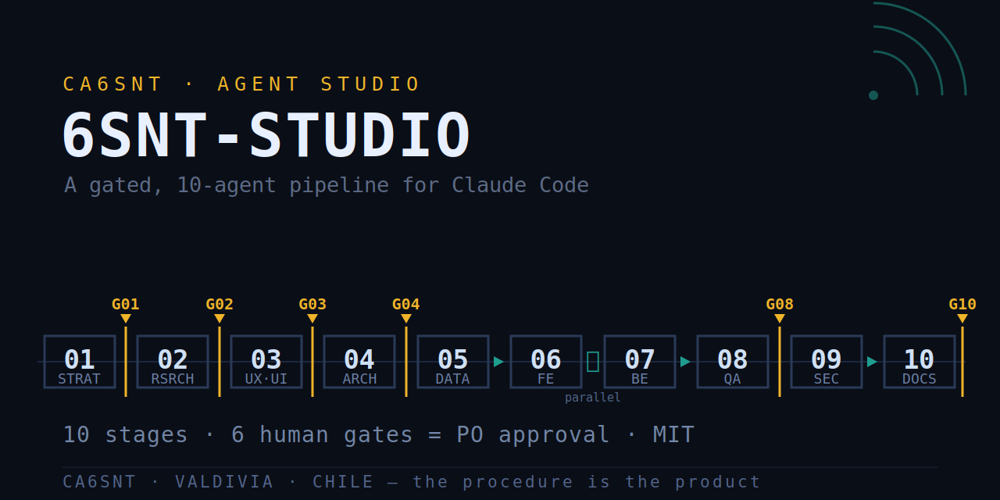
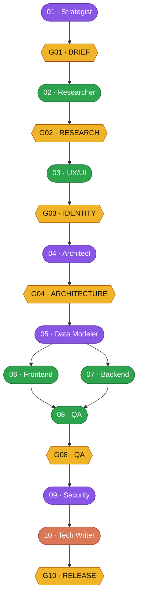

<p align="center">
  
</p>

# 6SNT-Studio

**A gated, 10-agent software studio for [Claude Code](https://docs.claude.com/en/docs/claude-code) (agent-teams).**

`English` · [Español](README.es.md)

[](LICENSE)


Ten specialized AI agents build software in a disciplined pipeline. Each agent owns exactly **one** deliverable, and **nothing advances without explicit human approval** at its gate. The result is AI-built software with the predictability of a real engineering process — not a one-shot prompt.

> **At a glance:** 10 agents · 6 human gates · 11 principles · 8 execution rules · 3-tier models (opus/sonnet/haiku) · local-first.

> The studio is **not a project** — it is the infrastructure that serves every project.
> Projects come and go; the studio stays.

— Built and operated by **CA6SNT** (Valdivia, Chile). Method-first, low-bureaucracy: *the procedure is the product.*

---

## 🚀 Install (Claude Code)

In a Claude Code session:

```
/plugin marketplace add 6SNT-RADIO/6SNT-Studio
/plugin install studio@6SNT-Studio
```

That installs the 10 agents, the skills, the hooks, the `/startsnt` kickoff command and the project scaffolder. Private repo? run `gh auth login` once first.

**Prerequisite — enable agent-teams.** The studio runs on Claude Code's experimental *agent-teams*. A plugin can't enable this for you, so add the flag to your `~/.claude/settings.json` and restart Claude Code:

```json
{ "env": { "CLAUDE_CODE_EXPERIMENTAL_AGENT_TEAMS": "1" } }
```

*(Optional: OpenTelemetry env vars for local observability — see [docs/PIPELINE.md](docs/PIPELINE.md).)*

Then, in a session rooted in your project folder, run `/startsnt` to begin the guided intake.

---

## 🧭 The idea in one picture



*Boxes are colored by model tier (opus / sonnet / haiku); the amber hexagons are the **human gates** (PO approval). 06 ∥ 07 run in parallel.*

A human **Product Owner (PO)** approves every gate. A **Lead** orchestrates (creates tasks, assigns owners, closes gates) but **never writes code or deliverables**. The ten agents do the work — one artifact each.

---

## 🧩 Three pieces

| Piece | Role |
|---|---|
| **Lead / Orchestrator** | Coordinates: classifies work size, builds the task graph, routes escalations, closes gates. Produces **no** deliverables. |
| **Agents 01–10** | Each executes its stage when activated and delivers a **single** artifact (see [AGENTS](docs/AGENTS.md)). |
| **Product Owner (human)** | Approves deliverables at each gate and makes the calls agents can't. No agent replaces the PO. |

---

## ✅ Why it works

- **One agent, one deliverable.** A hard ownership map (see [AGENTS](docs/AGENTS.md)) — an agent may *read* anything but only *writes* its own zone. Boundary clashes are escalated, never resolved between agents.
- **Proportional gating.** Work is classified **TRIVIAL / STANDARD / COMPLEX**; only the gates that matter run. Adding gates to a gated pipeline *increases* failure — so the studio defaults to the smallest size that fits.
- **Definition-of-Done is mechanical.** "Done" includes an artifact that **starts**, proven by an automated smoke test. Release is blocked until artifact + smoke-pass + assets exist.
- **Enforcement where it's deterministic, norms where it can't be.** Session-level guards are real locks; per-agent ownership is a *norm* audited post-hoc via OpenTelemetry traces. See [PIPELINE](docs/PIPELINE.md).

---

## 📚 Documentation

| Doc | What's inside |
|---|---|
| [docs/AGENTS.md](docs/AGENTS.md) | The 10 agents: role, model tier, single deliverable, ownership, escalation topology. |
| [docs/SKILLS.md](docs/SKILLS.md) | The studio's skills & tooling: smoke test, brand rubric, intake gating, scaffolding, evals, observability. |
| [docs/PIPELINE.md](docs/PIPELINE.md) | The gated pipeline, the 6 human gates, the task graph, size classification, and what's mechanical vs. norm. |
| [docs/PRINCIPLES.md](docs/PRINCIPLES.md) | Principles **P-01…P-11** and execution rules **RC-01…RC-08** (the studio's constitution). |

The runnable pieces live at the repo root: `agents/` (the 10 agents), `skills/` (21 skills), `hooks/`, `commands/` (`/startsnt`), `scripts/` (the scaffolder) and `templates/`. Spanish reference copies of the agents are under [`i18n/es/`](i18n/es/).

---

## 🎚️ Model tiers (cost-aware)

| Tier | Agents |
|---|---|
| **opus** | 01 Strategist · 04 Architect · 05 Data Modeler · 09 Security |
| **sonnet** | 02 Researcher · 03 UX/UI · 06 Frontend · 07 Backend · 08 QA |
| **haiku** | 10 Technical Writer |

The lead may bump a tier for a one-off hard task.

---

## 📦 Status

- ✅ Method validated by building **real desktop apps** end-to-end through the full gated pipeline (QA caught real domain bugs; Security remediated findings; brand & architecture passed machine rubrics).
- ✅ Runs on Claude Code **agent-teams** with native OpenTelemetry observability and `promptfoo` evals as a pre-gate.
- 🌐 Active agents/skills/command are **English**; Spanish reference copies live under `i18n/es/`.

---

## 🔧 Adapting it to your own work

The studio is **project-agnostic by design** (principle P-10): no agent hard-codes a specific project. To adopt it, you keep the constitution ([PRINCIPLES](docs/PRINCIPLES.md)) and the ownership map ([AGENTS](docs/AGENTS.md)), then point the agents at your stack. The reference stack here is Electron + TypeScript desktop apps, but the method is stack-neutral.

---

## ⚖️ License

[MIT](LICENSE) © 2026 CA6SNT (Luis Soto). Use it, adapt it, build with it.
